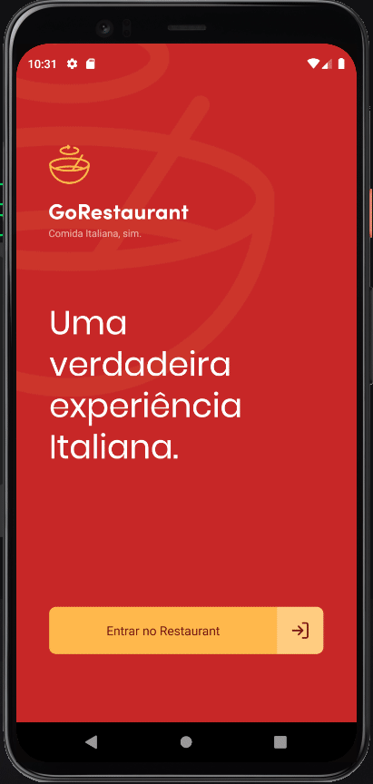
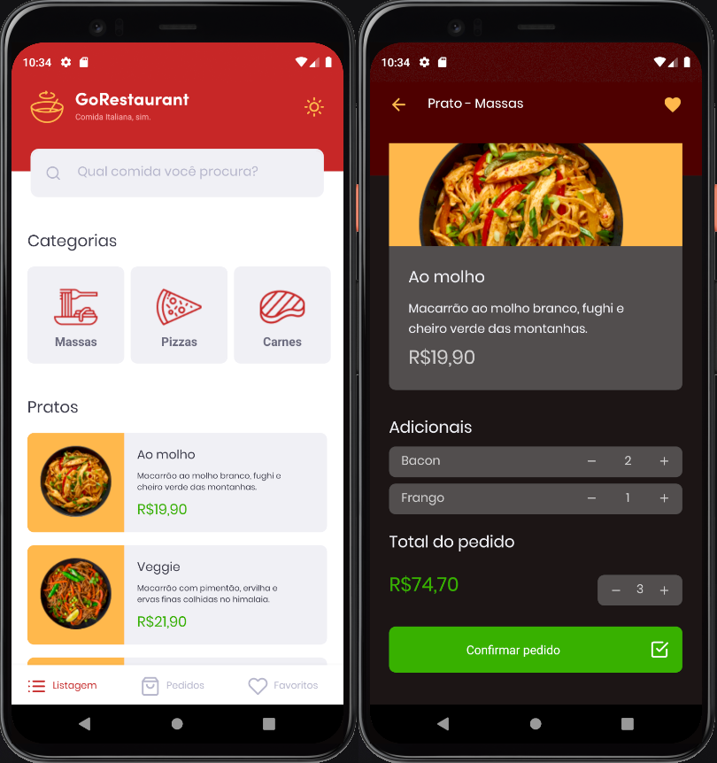

<h1 align="center">Challenge 10: GoRestaurant</h1>

  

  

  

  

  

 

  
  

 

</a>

## :memo: About

For this challenge, I developed the GoRestaurant mobile application, for the clients for to practice that I learned on `React Native` with Typescript and application concepts of `CRUD` (Create, Read, Update, Delete).

This application connecting with a `fake API` and shows every food registered and also is permitted a realization of these operations like
filter the foods from API and create orders.

This challenge is monitored by test, so I did have to do that all tests listed below passed

✅ should be able to navigate to the food details page 
✅ should be able to list the favorite food plates 
✅ should be able to list the orders 
✅ should be able to list the food 
✅ should be able to increment food quantity 
✅ should be able to decrement food quantity 
✅ should not be able to decrement food quantity below than 1 
✅ should be able to increment an extra item quantity 
✅ should be able to decrement an extra item quantity 

## :rocket: Extra implementation

* Toggle themes `(Dark mode)`
* Design System of colors with `styled-components`
* I centralized the handle of themes in a unique true point with `Context API `
* deploy the fake aPI on `Heroku`

